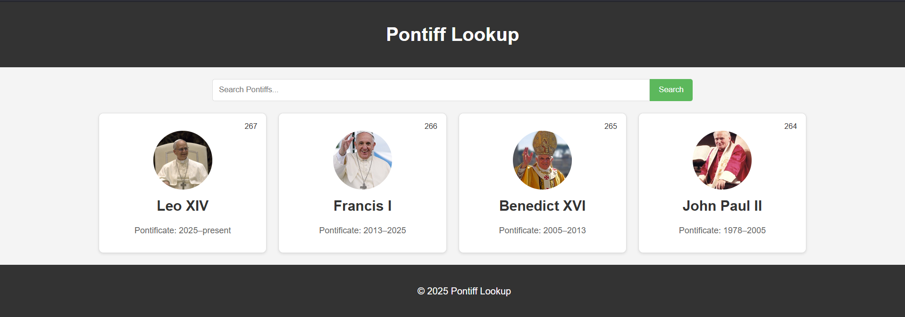

# Pontiff Lookup

This is a simple web application designed to present information about pontiffs and their significant works (publications, speeches, homilies) in an interactive and user-friendly manner, built with jQuery.

> <big>🚧⚠️ This project is still under development!</big>

## Project Structure

- `index.html`: The main HTML file, primarily acting as a container for the dynamically loaded content.
- `style.css`: Contains the CSS rules for styling the web application.
- `script.js`: Implements the interactive functionality using jQuery, including dynamic content generation, searching, and event handling.
- `pontiffs.json`: Store the data related to pontiffs and their works.

## Features

- **jQuery-driven UI**: The entire search and pontiff listing UI is generated dynamically by jQuery, keeping the `index.html` clean.
- **Search Functionality**: Users can search for pontiffs by name or by keywords found in their publications.
- **Dynamic Content Loading**: Pontiff information is loaded and displayed dynamically on the page.
- **User-Friendly Interface**: A clean and intuitive design for easy navigation and information access.

## How to Run

1.  Clone this repository to your local machine.
2.  Open the `index.html` file in your web browser. (Note: You need an internet connection for jQuery CDN.)

## Planned Enhancements

- [ ] **Exhaustive List of Pontiffs**: Collect publicly available information of pontiffs and organize the data inside `pontiffs.json`.
- [ ] **Detailed Pontiff View**: Implement a feature to click on a pontiff card and view more detailed information about their life and works.
- [ ] **Filtering Options**: Add more advanced filtering options beyond search, e.g., by pontificate period.
- [ ] **Accessibility Improvements**: Enhance accessibility for users with disabilities.
